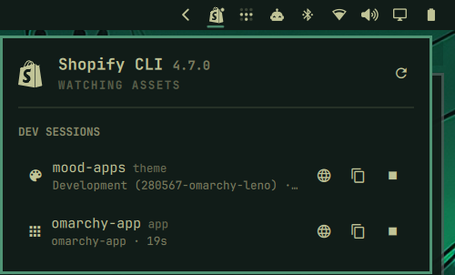

# Omarchy Shopify CLI — dev sessions in the Omarchy bar

Native [Omarchy](https://omarchy.org) shell plugin that shows your running
`shopify theme dev` and `shopify app dev` sessions in the bar, with a
keyboard-friendly panel to open previews, the theme editor, admin links,
copy URLs, and stop sessions.

Built as a first-class `bar-widget` plugin in the same style as the built-in
Tailscale and Dropbox panels.



## Features

- Bar icon that dims when idle and shows a dot when more than one session runs
  (optional text label: store name, or `2 themes + 1 app`)
- Hover tooltip with one line per session
- Panel listing every session: store, theme name / ID / port or app name,
  project folder, and a live running time
- Per-session actions: open local preview, theme editor, share-preview link,
  storefront, store admin, app in admin, GraphiQL and the local app URL for
  `app dev`; open a Liquid console (`shopify theme console`) or the app log
  stream (`shopify app logs`) in a terminal; copy any URL, the store domain,
  theme ID / client ID, or the project path; stop the session (SIGINT, then
  SIGTERM if it ignores that — same as Ctrl+C in its terminal)
- Shows the installed CLI version in the panel header, and theme dev modes
  (`--theme-editor-sync`, `--live-reload`) in the session line
- Detects sessions by inspecting `/proc` and verifying the process executable
  is actually the CLI's runtime — no `pgrep -f`-style false positives from
  editors or shells that merely mention "shopify theme dev"
- Store, theme ID, port and app details are read from the process's flags and
  environment (`--store`, `-e`, `SHOPIFY_FLAG_STORE`, …), the listening
  socket, `shopify.theme.toml` and `shopify.app.toml`. Only the development
  theme's name / ID need the CLI (`shopify theme info --development --json`),
  which runs once per session in the background and is cached.

## Install

```bash
omarchy plugin add https://github.com/uwagz/omarchy-shopify-cli.git --enable
```

The widget lands in the right section of the bar; move it with
`omarchy bar move uwagz.shopify-cli` if you prefer another spot.

Requirements: Omarchy 4 (`omarchy-shell`), `python3` (3.11+ for the
`*.toml` lookups), the [Shopify CLI](https://shopify.dev/docs/api/shopify-cli)
on `PATH`, and `wl-copy` for the copy actions.

## Usage

| Mouse              | Action                                     |
|--------------------|--------------------------------------------|
| Left click         | Toggle the panel                           |
| Right click        | Open the first session's primary link      |
| Middle click       | Refresh now                                |
| Click a row        | Open its primary link (theme: local preview; app: app in admin) |
| 󰖟 on a row          | Link menu                                  |
| 󰆏 on a row          | Copy menu                                  |
| 󰓛 on a row          | Stop that session                          |

Inside the panel (keys follow the hint line `shopify theme dev` prints):

| Key              | Action                                        |
|------------------|-----------------------------------------------|
| `j` / `k`, arrows | Move the cursor                              |
| `Enter` / `Space` | Open the selected session's primary link (header: refresh) |
| `l` / `→`         | Open the link menu for the selected session  |
| `h` / `←`, `Esc`  | Close an open menu                           |
| `t`               | Open the local preview (`http://127.0.0.1:9292`) |
| `e`               | Open the theme editor / customizer           |
| `p`               | Open the shareable preview link (`?preview_theme_id=…`) |
| `g`               | Open GraphiQL for an `app dev` session (like the CLI's own `g`) |
| `o`               | Open the primary link                        |
| `a`               | Open the store admin                         |
| `s`               | Open the storefront                          |
| `c`               | Copy menu                                    |
| `f`               | Reveal the project folder                    |
| `x`               | Stop the selected session                    |
| `r`               | Refresh                                      |
| `Esc`             | Close the panel                              |

IPC for scripts and keybindings:

```bash
omarchy-shell uwagz.shopify-cli toggle     # open/close the panel
omarchy-shell uwagz.shopify-cli status     # "1 theme + 1 app" / "No dev sessions"
omarchy-shell uwagz.shopify-cli count      # number of sessions
omarchy-shell uwagz.shopify-cli sessions   # JSON array with every session
omarchy-shell uwagz.shopify-cli refresh
```

`sessions` returns upstream strings (theme/app names, store, error text)
verbatim — consume it as data (parse the JSON), never `eval` it or render it
as markup.

## Removal

```bash
omarchy plugin remove uwagz.shopify-cli
```

This deletes `~/.config/omarchy/plugins/uwagz.shopify-cli/` and takes the
widget out of the bar. The plugin's only other footprint is its cache at
`~/.cache/omarchy-shopify-cli/`, safe to delete at any time. It never edits
`~/.config/omarchy/shell.json` or any other user configuration itself —
enable/disable and placement go through `omarchy plugin` / `omarchy bar`.

## Settings

Configure from the bar settings UI, or with `omarchy bar set`:

| Key                  | Default | Description                                                |
|----------------------|---------|------------------------------------------------------------|
| `refreshIntervalSec` | `10`    | Rescan interval while the panel is closed (2–300 s); it polls every 2 s while open |
| `fetchDetails`       | `true`  | Ask the Shopify CLI for the dev theme's name / ID / role   |
| `showWhenIdle`       | `true`  | Keep the icon in the bar when nothing is running           |
| `showLabel`          | `false` | Show the store name (or session count) next to the icon    |

```bash
omarchy bar set uwagz.shopify-cli showLabel true --json
omarchy bar set uwagz.shopify-cli fetchDetails false --json
```

## How it works

```
Panel.qml         bar button + popup (cursor rows, link/copy menus, IPC)
Service.qml       timers, runs status.py, owns every action (open/copy/stop/terminal)
Model.js          pure helpers: URLs, labels, parsing (node-testable)
ShopifyIcon.qml   Shopify mark rendered natively from its SVG path, with count badge
status.py         3-line entry point
shopify_cli_status.py /proc scan → sessions JSON; detached, cached CLI lookups
```

`status.py` walks `/proc` for processes **owned by you** that are a Shopify
CLI dev invocation: the `shopify` token must be `argv[0]` or `argv[1]` (a
binary, or an interpreter running the CLI script) and `/proc/<pid>/exe` must
be a JS runtime (`node`/`bun`/`deno`) or a `shopify` binary — so an unrelated
process that merely has `shopify theme dev` somewhere in its arguments is not
treated as a session. The CLI's own helper children (`shopify notifications
list`) are ignored. It reads each session's cwd, flags, environment and
listening ports (for `app dev`, across the whole child process tree, which is
how GraphiQL on `:3457` and a `--use-localhost` app URL are found), and prints
JSON. The CLI version comes from the package.json next to the resolved
`shopify` executable (resolving through a mise/asdf shim once, cached), never
from running `shopify version`. When `fetchDetails` is on and a theme
session's details are not cached yet, it spawns a detached copy of itself that
runs `shopify theme info --development --json --path=<project> [--store=…]`
with `CI=1` (so it can never pop a login prompt) and writes the result to
`~/.cache/omarchy-shopify-cli/<pid>-<start>.json`; the next poll picks it up. Cache entries
for sessions that have exited are removed automatically.

The only Shopify CLI commands this plugin ever runs are `shopify theme info`
and `shopify app info`. It never pushes, pulls, publishes or deploys anything.

Cost: one idle poll is a ~20 ms `python3 -S status.py` (stdlib only, no
`json`/`re` on the hot path, bytecode cached under `~/.cache/omarchy-shopify-cli/pycache`;
~6 ms of it is the actual `/proc` walk). At the default 10 s that is well
under half a percent of one core, in the same ballpark as the built-in
Tailscale and Dropbox panels. The session list is only republished to the UI
when something other than the clock changed, so rows are not rebuilt on every
poll; the duration ticker runs at 1 s only while a session is under a minute
old (30 s after), and the hero phrases only while the panel is open.

## Security & privacy

Like every Omarchy shell plugin, this runs as unsandboxed code inside
`omarchy-shell`. What it actually does:

- **Only your own processes.** The `/proc` scan is filtered to your UID, and a
  process is treated as a session only after the executable and argv checks
  above — not on a substring match.
- **No credentials.** Only a whitelist of `SHOPIFY_FLAG_*` display keys (store,
  port, theme id, environment, config, auth-alias nickname) is read from a
  session's environment. `SHOPIFY_CLI_THEME_TOKEN`, passwords and other secrets
  are never read, cached, or emitted. `--auth-alias` is a profile nickname, not
  a secret; the Shopify CLI authenticates itself from its own store.
- **Read-only CLI use.** The only commands ever run are `shopify theme info`
  and `shopify app info`, detached, with `CI=1` so they can't prompt or log in.
  Never push/pull/publish/deploy. Terminal actions (`theme console`, `app logs`)
  are launched only when you pick them, in a visible terminal.
- **Stopping is signal-safe.** Stop opens a `pidfd` for the exact process
  instance and signals through it (`SIGINT`, then `SIGTERM`), so a pid reused
  after the session exits can never be signalled. It only ever signals your own
  processes and never uses `SIGKILL`.
- **Untrusted repo data is inert.** Values from a cloned repo's
  `shopify.app.toml` / `shopify.theme.toml` or from CLI JSON are rendered as
  plain text (no QML rich-text/`` injection), links are opened only when
  they are `http(s)` URLs, and CLI flags are passed as `--flag=value`.
- **Writes stay in the cache.** The only files written are under
  `~/.cache/omarchy-shopify-cli/`. It never edits `shell.json` or any other
  configuration.

## Development

```bash
git clone https://github.com/uwagz/omarchy-shopify-cli.git
omarchy plugin validate ./omarchy-shopify-cli
cp -r omarchy-shopify-cli ~/.config/omarchy/plugins/uwagz.shopify-cli   # or: omarchy plugin add <path>
omarchy plugin enable uwagz.shopify-cli
python3 status.py --no-details | jq      # helper output without touching the CLI
node -e 'console.log(require("./Model.js").linkOptions({kind:"theme",store:"my-store",themeId:"1"}))'
```

Saving files under `~/.config/omarchy/plugins/` hot-reloads the plugin. Shell
logs are in `journalctl --user`.

## License

MIT — see [LICENSE](LICENSE).
